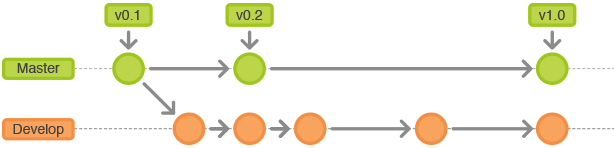

#  GitFlow
#### 导语
> Git是一种强大的版本控制工具。不同于svn，它更加强调一种适合团队工作、分布式管理的工作流程。不要被“团队工作”、“分布式管理”所吓倒。感谢Vincent Driessen和其他开源工作者的不懈努力与无私奉献，针对Git的工作流程——GitFlow不但功能强大而且简单易懂。

## 一、认识GitFlow

顾名思义，工作流（Workflow）即指工作流程。本文不会介绍工作流本身，理由如下。

>工作流（WorkFlow）本身不是一个初级主题，背后的本质问题其实是有效的项目流程管理和高效的开发协同约定，不仅是Git或SVN等VCS或SCM工具的使用。

上面一段话摘自[xirong在segmentationfault上整理的文章](https://segmentfault.com/a/1190000002918123)。可以看到，workflow已经超出了GitFlow的讨论范围。

### 工作方式

GitFlow工作流定义了一个围绕项目发布的严格分支模型：使用中央仓库为所有开发者的交互中心，开发者在本地工作并push分支到要中央仓库中。

#### 历史分支

GitFlow工作流使用2个分支来记录项目的历史：master分支存储正式发布的历史；develop分支作为功能的集成分支。

#### 功能分支

每个功能（Feature）拥有独立的分支。从develop分支上建立新分之后，在其基础上开发、完善功能，新功能完成之后合并回develop分支。当然，这些分支不一定根据功能来划分。不同的团队、开发者，均可以作为分支的依据。不过推荐使用功能作为分支依据。这（似乎）是程序员长期实践后得出的结论。

#### 发布分支

当需要发布或者开始准备发布工作时，应当从develop分支上新建一个发布分支。该分支仅用于发布，这意味着创建该分支后添加的所有功能不会加入发布分支。发布完成后，将发布分支合并到master分支上，分配版本号，打好Tag。另外，从建立发布分支以来做的修改要合并回develop分支。

#### 维护分支

维护分支用于快速修复发布版本（production release）的漏洞，是唯一从master分支中fork出来的分支。修复完成后，应马上合并回master分支、develop分支、当前发布分支。master分支应用新的版本号打好Tag。

至此，GitFlow的大致流程就介绍完了。

## 二、为何使用GitFlow

## 三、如何使用GitFlow

    